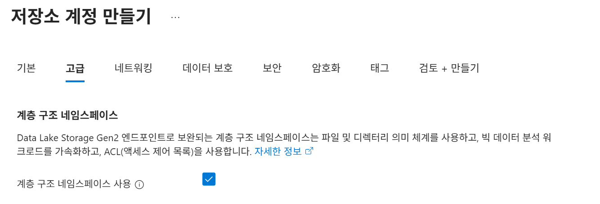

# 3. Foundry IQ RAG 구성

에이전트가 보다 정확하고 신뢰도 높은 답변을 생성하기 위해서는 조직 내에 분산되어 있는 엔터프라이즈 데이터와 문서에 대한 컨텍스트가 필요합니다. Foundry IQ를 활용하면 조직의 데이터를 기반으로 권한을 인식(Permission-aware)하는 응답을 제공할 수 있는 구성형 멀티소스 지식 베이스(Knowledge Base)를 구축할 수 있습니다.

Foundry IQ는 아래와 같은 다양한 데이터 소스를 연결하여 활용할 수 있습니다.

- Azure AI Search 인덱스
- Azure Blob Storage
- 웹(Web)
- Microsoft SharePoint (Remote)
- Microsoft SharePoint (Indexed)
- Microsoft OneLake

### RAG(Retrieval-Augmented Generation) 구성

이제 실제 금융 데이터를 기반으로 에이전트가 보다 정확하고 근거 기반의 응답을 수행할 수 있도록 RAG(Retrieval-Augmented Generation) 구성을 진행해보겠습니다.

Azure에서는 엔터프라이즈 검색과 벡터 검색(Vector Search) 기능을 제공하는 Azure AI Search를 활용하여 RAG 아키텍처를 구현할 수 있으며, 이를 통해 금융상품 설명서, 약관, FAQ, 내부 업무 가이드와 같은 문서를 기반으로 신뢰도 높은 응답을 생성할 수 있습니다.

### 임베딩 모델 배포

이번 챕터에서 진행에 필요한 임베딩 모델을 배포하도록 하겠습니다.

1. [Microsoft Foundry 포털](http://ai.azure.com)로 이동합니다.
2. `ai-project-<alias>` 프로젝트를 선택합니다.
3. 상단 메뉴에서 `빌드`를 클릭하고, 왼쪽 메뉴에서 `모델`을 클릭합니다.
4. `기본 모델 배포` 버튼을 클릭합니다.
5. `text-embedding-3-large`를 찾아서 선택하고 `배포` 버튼을 클릭합니다.

## Search Service 구성

### Search Service 생성

1. 브라우저에서 Azure Portal 탭 혹은 새 탭을 열어 [Azure Portal](https://portal.azure.com)에 접속합니다.
2. 상단 검색창에서 `AI Search`를 입력하고 메뉴를 선택합니다.
3. Microsoft Foundry | AI Search 화면에서 `만들기` 버튼을 클릭합니다.
4. `기본` 탭을 아래와 같이 구성합니다.
    - 리소스 그룹 : ai-workshop-rg
    - 서비스 이름 : finassist-search-<alias>
    - 위치 : (Asia Pacific) Korea Central
    - 가격 책정 계층 : 표준
    - 컴퓨팅 유형 : Default
5. 나머지 옵션은 그대로 두고 `검토+만들기` 버튼을 클릭하고 한 번 더 `만들기` 버튼을 클릭합니다.
6. 리소스가 생성되면 `리소스로 이동` 버튼을 클릭합니다.
7. 왼쪽 메뉴에서 `설정` > `ID` 를 클릭합니다.
8. `시스템 할당 항목`에서 상태를 `켜기`로 수정하고 `저장` 버튼을 클릭합니다.

### 스토리지 계정 생성

에이전트 검색을 위한 지식 원본 기능을 제공합니다. 지식 원본은 오브젝트 스토리지 서비스인 Azure Blob에 올려두고 인덱싱을 진행해 보겠습니다.

1. 상단 검생창에서 `스토리지 계정`을 입력하고 메뉴를 선택합니다.
2. `만들기` 버튼을 클릭합니다.
3. `기본` 탭을 아래와 같이 구성합니다.
    - 리소스 그룹 : ai-workshop-rg
    - 스토리지 계정 이름 : datasourcesa<alias>
    - 지역 : (Asia Pacific) Korea Central
    - 기본 설정 스토리지 유형 : Azure Blob Storage 또는 Azure Data Storage Gen2
    - 성능 : 표준
    - 중복도 : GRS(지역 중복 스토리지)
4. `고급` 탭에서 `계층 구조 네임스페이스 사용`을 체크합니다.
    
    
    
5. 나머지 설정은 그대로 두고 하단의 `검토+만들기` 버튼을 클릭, `만들기` 버튼을 클릭해서 구성을 완료합니다.
6. 리소스 배포가 완료되면 `리소스로 이동` 버튼을 클릭합니다.

### 스토리지 계정 권한 설정

Microsoft Entra 자격 증명을 사용하여 Azure Portal에서 Blob 데이터에 액세스하려면 사용자는 최소한 Azure Resource Manager **Reader** 역할과 **Storage Blob Data Reader** 또는 **Storage Blob Data Contributor** 역할과 같은 데이터 액세스 역할이 있어야 합니다.

[Blob 데이터 액세스에 대한 Azure 역할 할당 - Azure Storage | Microsoft Learn](https://learn.microsoft.com/ko-kr/azure/storage/blobs/assign-azure-role-data-access?tabs=portal)

1. 스토리지 계정 왼쪽 메뉴에서 `액세스 제어(IAM)`을 클릭합니다.
2. 상단의 `추가` > `역할 할당 추가`를 클릭합니다.
3. 검색 상자에 blob을 입력하고, `Storage Blob 데이터 Contributor`를 선택하고 `다음` 버튼을 클릭합니다.
    
    
    
4. 구성원 탭에서 `다음에 대한 액세스 할당 : 사용자, 그룹 또는 서비스 주체`를 선택하고 `구성원 선택`을 클릭합니다.
5. 구성원 선택 화면에서 본인 계정을 선택하고 `선택` 버튼을 클릭합니다.
    
    
    
6. `검토+할당` 버튼을 클릭합니다.
7. 동일한 방법으로 `독자` 권한도 추가합니다.
    
    
    

### 데이터 원본 구성

1. 스토리지 계정 왼쪽 메뉴에서 데이터 `스토리지 > 컨테이너`를 클릭합니다.
2. `컨테이너 추가` 버튼을 클릭합니다.
3. 새 컨테이너 화면에서 이름에 `finassist-source` 을 입력하고 `만들기` 버튼을 클릭합니다.
4. 컨테이너 리스트에서 생성한 `finassist-source`를 클릭하고, `업로드` 버튼을 클릭합니다.
5. 앞서 사용한 `products.json` , `policy_docs.json` , `faq.json` , `advisor_guide.json` 파일을 선택해서 추가하고 업로드 버튼을 클릭합니다.
    
    
    
    
    

### AI Search 권한 설정

- Azure AI Search에서 데이터 소스(지식 원본)를 연결할 때, 컨테이너 액세스 권한이 필요합니다.
- Azure AI Search에서 '통합 벡터화(Integrated Vectorization)' 기능을 사용하여 **텍스트 벡터기(Vectorizer)를 Microsoft Foundry(또는 Azure OpenAI/Azure AI Services)의 임베딩 모델로 설정한 경우**, AI Search의 인덱서(Indexer)가 텍스트를 분할하고 Foundry 엔드포인트를 호출해 벡터 값을 받아와야 합니다.

#### Azure CLI를 사용하여 구성

**AI Search → 컨테이너 액세스 권한**

1. [Azure Portal](https://portal.azure.com) 상단의 Cloud Shell 버튼을 클릭합니다.
    
    
    
2. `Azure Cloud Shell` 시작 팝업에서 `Bash`를 클릭합니다.
3. `시작` 팝업에서 `스토리지 계정이 필요하지 않음`을 선택하고 구독을 선택한 뒤, `적용` 버튼을 클릭합니다.
4. 아래 CLI를 수정하여 적용합니다.

**[준비 작업] 변수 정의**

```bash
export RG_NAME="ai-workshop-rg"
export SUB_ID=$(az account show --query id -o tsv)
export RG_SCOPE="/subscriptions/$SUB_ID/resourceGroups/$RG_NAME"

# 각 서비스의 Principal ID (리소스 생성 후 확보되는 ID 값들)
export USER_EMAIL="username@yourdomain.com"
export HUB_PRINCIPAL_ID="AI_Foundry_Hub_관리ID_오브젝트ID"
export SEARCH_PRINCIPAL_ID="AI_Search_관리ID_오브젝트ID"
```

**실습자(User) 권한 부여 (최초 1회 실행)**

```bash
# 실습자 계정에게 리소스 그룹 내 모든 AI 및 데이터 제어 권한을 한 번에 부여
for role in "Azure AI Developer" "Search Index Data Contributor" "Search Service Contributor" "Storage Blob Data Contributor"; do
    az role assignment create \
        --assignee "$USER_EMAIL" \
        --role "$role" \
        --scope $RG_SCOPE
done
```

**Microsoft Foundry Hub / Project 관리 ID 권한 부여**

```bash
# AI Foundry Hub(또는 프로젝트) 관리 ID에 리소스 그룹 범위 권한 일괄 부여
for role in "Cognitive Services OpenAI User" "Search Index Data Contributor" "Search Service Contributor" "Storage Blob Data Contributor"; do
    az role assignment create --assignee-object-id $HUB_PRINCIPAL_ID --role "$role" --scope $RG_SCOPE --assignee-principal-type ServicePrincipal
done
```

**Azure AI Search 권한 부여**

```bash
# Azure AI Search 관리 ID가 스토리지와 OpenAI에 접근할 수 있도록 권한 부여
for role in "Storage Blob Data Reader" "Cognitive Services OpenAI User"; do
    az role assignment create --assignee-object-id $SEARCH_PRINCIPAL_ID --role "$role" --scope $RG_SCOPE --assignee-principal-type ServicePrincipal
done
```

### 지식 원본 추가

1. 포털에서 다시 Search Service로 이동해 `finassist-search-<alias>`를 클릭합니다.
2. 왼쪽 메뉴에서 `에이전트 검색` > `지식 원본`를 클릭합니다.
3. 상단의 `지식 원본 추가` 버튼을 클릭합니다.
4. 지식 원본 만들기 화면에서 `Azure Blob(인덱싱됨)`을 클릭하고 아래와 같이 구성합니다.
    - 이름 : finassist-knowledge-source
    - 스토리지 계정 : dataasourcesa<alias>
    - Blob 컨테이너 : finassist-source
5. `텍스트 벡터화 사용` 섹션에서 `벡터라이저 추가` 버튼을 클릭합니다.
6. 벡터기 화면을 아래와 같이 구성하고 `저장` 버튼을 클릭합니다.
    
    
    
    - 종류 : Microsoft Foundry
    - Microsoft Foundry 프로젝트 : ai-project-<alias>
    - 모델 배포 : text-embedding-3-large
7. `만들기` 버튼을 클릭해 지식 원본 구성을 완료합니다.
    
    
    

### 지식 기반 추가

> Foundry 포털에서 gpt-4.1 모델을 배포합니다.
> 

> 에이전트에는 이미 GPT 모델이 연결되어 있지만, Foundry의 Knowledge Connection은 독립적인 Retrieval Pipeline 리소스로 동작하기 때문에 Query Rewrite·Grounding·검색 테스트 등을 위해 별도의 Chat Model 참조를 추가로 요구합니다. 실제 최종 응답 생성은 에이전트의 모델이 수행합니다.
> 

1. 왼쪽 메뉴에서 `에이전트 검색` > `지식 기반`를 클릭합니다.
2. 상단의 `지식 기반 추가` 버튼을 클릭합니다.
3. 아래와 같이 구성합니다.
    
    **Basics**
    
    - 이름 : finassist-search-base
    - 지식 원본 : 기존 항목 추가
    - 지식 원본 선택 : Azure Blob 선택
    
    **검색**
    
    
    
    - 모델 배포 추가 클릭
    - 종류 : Microsoft Foundry
    - 프로젝트 : ai-project-alias
    - 모델 배포 : gpt-4.1
4. `저장` 버튼을 클릭합니다.

## 에이전트에 지식 추가

### 지식 섹션 구성

1. [Microsoft Foundry 포털](https://ai.azure.com)로 이동합니다.
2. `빌드` > `지식` 메뉴를 클릭합니다.
    - Azure AI Search 리소스 : finassist-search-annajeong
    - 인증 유형 : API 키

### 에이전트에 지식 추가

1. 에이전트 화면에서 `FinAssistAI`를 클릭합니다.
2. `도구` 섹션에서 기존에 추가했던  `파일 검색` 항목을 클릭하고 `연결 끊기`를 클릭합니다.
3. `지식` 섹션에서 `추가` 버튼을 클릭하고 `Foundry IQ`에 연결 버튼을 클릭합니다.
4. Foundry IQ에 연결 팝업에서 아래와 같이 구성하고 `연결` 버튼을 클릭합니다.
    - 연결 : finassist-search-alias
    - 지식 기반 : finassist-search-base
5. 지식 - Foundry IQ에 도구 추가 후, 아래 프롬프트를 실행해 봅니다.
    
    ```
    정기예금 중도해지 시 고객에게 어떤 내용을 안내해야 하나요?
    
    안정형 고객에게 글로벌 테크 성장 펀드를 설명할 때 주의할 점은 무엇인가요?
    
    IRP 상품 상담 시 세액공제와 중도인출 관련해서 무엇을 설명해야 하나요?
    ```
    
6. `승인` 버튼을 클릭하고, `항상 이 도구 승인`을 클릭합니다.
    
    
    
7. 상단 `로그` 버튼을 통해 정상적으로 도구 호출이 된 것을 확인할 수 있습니다.
    
    
    
    
