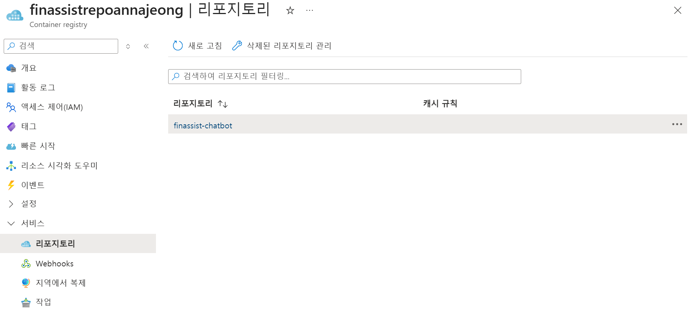

# 4. Container Apps에 챗봇 배포

Microsoft Foundry에서 개발한 에이전트를 동일하게 Container Apps에 배포해보도록 하겠습니다. 프로젝트에 구성된 OpenAI 엔드포인트와 AI Search의 엔드포인트를 활용하는 챗봇 UI를 포함한 컨테이너 이미지를 Container Apps에 배포합니다.

## 컨테이너 이미지 구성

### 컨테이너 레지스트리 생성

1. [Azure Portal](https://portal.azure.com) 검색창에 `container`를 입력하고 `Container Registries` 메뉴를 클릭합니다.
2. 상단 `만들기` 버튼을 클릭합니다.
3. `기본` 탭을 아래와 같이 구성하고 나머지 설정은 그대로 둡니다.
    - 리소스 그룹 : ai-workshop-rg
    - 레지스트리 이름 : finassistrepo<alias>
    - 위치 : Korea Central
    - 가격 책정 플랜 : 표준
4. `검토+만들기` 버튼을 클릭하고, `만들기` 버튼을 클릭해서 만들기를 완료합니다.

### 컨테이너 이미지 구성

1. 컨테이너 레지스트리 생성이 완료되면, 상단의 `Cloud Shell` 버튼을 클릭합니다.
2. Docker Hub에 업로드 된 이미지를 컨테이너 레지스트리로 가져옵니다. (또는 GitHub Repo의 파일을 빌드하여 직접 업로드해도 됩니다.)
    
    ```bash
    az acr import \
      --name finassistrepoannajeong \
      --source docker.io/annajeong/finassist-chatbot:v1 \
      --image finassist-chatbot:v1
    ```
    
3. 이미지를 가져오고 나면 왼쪽 메뉴에서 `서비스` > `리포지토리`를 클릭합니다.
    
    
    

## Container Apps 구성

### Container Apps 생성

이제 이 이미지를 사용해 실제 서비스를 배포 해보겠습니다.

1. 상단 검색창에 `container`를 입력해 `Container Apps` 메뉴를 클릭합니다.
2. `만들기` 버튼을 클릭하고 `컨테이너 앱`을 선택합니다.
3. `기본` 탭을 아래와 같이 구성하고 `다음: 컨테이너>` 버튼을 클릭합니다.
    
    **프로젝트 세부 정보**
    
    - 리소스 그룹 : ai-workshop-rg
    - 컨테이너 앱 이름 : finassist-app-alias
    - 배포 원본 : 컨테이너 이미지
    
    **Container Apps 환경**
    
    - 지역 : Korea Central
    - Container Apps 환경 : (신규)
4. `컨테이너` 탭을 다음과 같이 구성합니다.
    
    
    
    - 이름 : finassist-app
    - 이미지 원본 : Azure Container Registry
    - 레지스트리 : finassistrepo<alias>azureacr.io
    - 이미지 : finassist-chatbot
    - 이미지 태그 : v1
5. 구성이 완료되면 `다음 : 수신>` 버튼을 클릭합니다.
6. `수신` 탭을 아래와 같이 구성하고 리소스를 생성합니다.
    
    **애플리케이션 수신 설정**
    
    - 수신 : 체크
    - 수신 트래픽 : 어디서나 트래픽 허용

### Container Apps 환경 변수 구성

1. 생성된 `Container App` 리소스 화면으로 이동합니다.
2. 왼쪽 사이드바 메뉴 중 `애플리케이션` 섹션 하위에 있는 `수정 버전 및 복제본` 메뉴를 선택합니다.
3. 화면 상단 툴바에 있는 `새 수정 버전 만들기` 버튼을 클릭합니다.
4. 컨테이너 행에 `finassist-app`을 클릭한 뒤, 우측에 `편집` 버튼을 누릅니다.
5. 컨테이너 템플릿 편집 창이 열리면 `환경 변수` 탭으로 이동합니다.
6. `+ 추가` 버튼을 눌러 누락된 5가지 환경 변수 세트를 채워 넣습니다.
7. `Cloud Shell` 버튼을 클릭하여 터미널을 엽니다.
    
    - **AZURE_OPENAI_ENDPOINT**
        
        생성한 Azure OpenAI 서비스(또는 Cognitive Services 통합 계정)의 Endpoint 주소를 가져옵니다.
        
        ```bash
        https://ai-project-alias-resource.openai.azure.com
        
        az cognitiveservices account show \
          --name "ai-project-alias-resource" \
          --resource-group "ai-workshop-rg" \
          --query "properties.endpoint" \
          -o tsv
        ```
        
    - **AZURE_SEARCH_ENDPOINT**
        
        Azure AI Search 서비스의 엔드포인트 URI 대상 주소를 가져옵니다.
        
        ```bash
        https://finassist-search-alias.search.windows.net
        ```
        
    - **AZURE_SEARCH_INDEX**
        
        

    - **AZURE_SEARCH_ENDPOINT**
        
        AI Search 데이터베이스에 쿼리를 날리거나 문서를 조회하기 위한 기본 관리자 키(Admin Key) 원본을 가져옵니다.
        
        ```bash
        az search admin-key show \
          --service-name "finassist-search-alias" \
          --resource-group "ai-workshop-rg" \
          --query "primaryKey" \
          -o tsv
        ```

        
8. 구성을 완료하고 `저장` 버튼을 클릭하고 `만들기` 버튼을 클릭합니다.

### MS Foundry 프로젝트 액세스 권한 설정

MS Foundry 프로젝트의 모델 등에 액세스 하기 위해 Container Apps의 Managed Identity를 활용합니다.

1. 좌측 메뉴 중 `보안` 하위의 `ID` 메뉴를 클릭합니다.
2. `시스템 할당 항목`의 상태를 `켜기`로 변경하고 `저장` 버튼을 클릭합니다.
3. 상단 검색창에 `foundry`를 입력하여 `Microsoft Foundry` 화면으로 이동합니다.
4. 왼쪽 메뉴에서 `Foundry와 함께 사용` > `Foundry`를 클릭하고 생성한 프로젝트를 선택합니다.
5. 왼쪽 메뉴에서 `액세스 제어(IAM)`을 클릭합니다.
6. 상단의 `추가` 버튼을 클릭하고 `역할 할당 추가` 버튼을 클릭합니다.
7. 역할 검색 창에서 `cognitive`를 입력하여 `Cognitive Services 사용자`를 선택하고 `다음` 버튼을 클릭합니다.
8. `구성원` 탭에서 `다음에 대한 액세스 할당 : 관리 ID`를 선택하고 `+구성원 선택` 버튼을 클릭합니다.
9. `관리 ID`에서 `컨테이너 앱`을 선택하고, 생성한 컨테이너 앱을 선택하고 `선택` 버튼을 클릭합니다.
10. `검토+할당` 버튼을 클릭합니다.
11. 컨테이너 앱 화면으로 돌아와 `개요` 페이지의 `애플리케이션 URL`을 클릭합니다.
    
    
